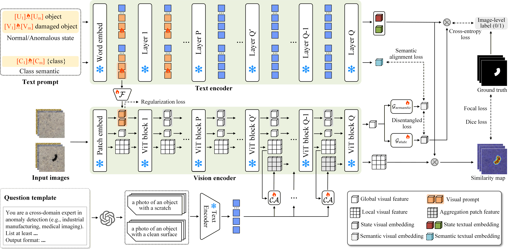

# DIVE
Implementation of ["Robust Zero-shot Anomaly Detection under Limited Auxiliary Anomaly Priors"]. (Accepted by ECCV 2026)

The code is currently being organized and will be released soon.

## Paper abstract
Zero-shot anomaly detection aims to identify defects in arbitrary novel domains; however, existing models assume that the auxiliary data contains a rich diversity of anomalies, neglecting the far more complex and unpredictable variations in real-world target domains. This study introduces DIVE, the first approach to investigate the scenario of limited auxiliary anomaly priors and resolve the resulting substantial performance degradation. Through a shallow-and-deep text embedding injection strategy during visual encoding, DIVE learns to abstract generic anomaly concepts shared across the auxiliary training domain and diverse target domains. Moreover, we propose a disentanglement mechanism to tackle the suboptimal alignment between visual embeddings entangled with object semantics and object-agnostic textual prompts. Experiments demonstrate that, under the setting of limited anomaly patterns in auxiliary data, DIVE outperforms SOTA baselines by up to 16.2% and 28.5% on two classification metrics, and 23.4%, 24.1%, and 47.0% on three segmentation metrics, in terms of average performance across twelve datasets. Furthermore, it maintains highly competitive performance when auxiliary data exhibits sufficient anomaly diversity.

---

